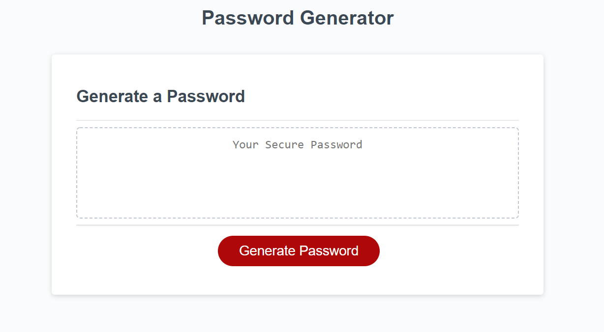

# Password Generator 

## Description

This project explored fundamental Javascript basics. The project consisted of conditional statements, for loops, functions, methods, querySeletors, eventListeners, CSS ids , and CSS classes. I took the assignment a step farther by incorporating object. This object was use to store an array. Each array consisted of a boolean and the character types. To access the object I explored the dot notation and bracket notation. I choose to store information in an object because it made it easy to loop over the characters and check for boolean values. Moreover, I refactor my JS to only contain 56 lines with commenting.

## Installation

Access to repository here:
[Repository url](https://github.com/myang5t3r/PasswordGenerator)

Live Deployment here:
[https://myang5t3r.github.io/Professional_Portfolio/](https://myang5t3r.github.io/PasswordGenerator/)

## Usage
The usages of this project is for informational and learning purposes only.  
Everyone is welcome to generate a random password. 😁 
 
 

